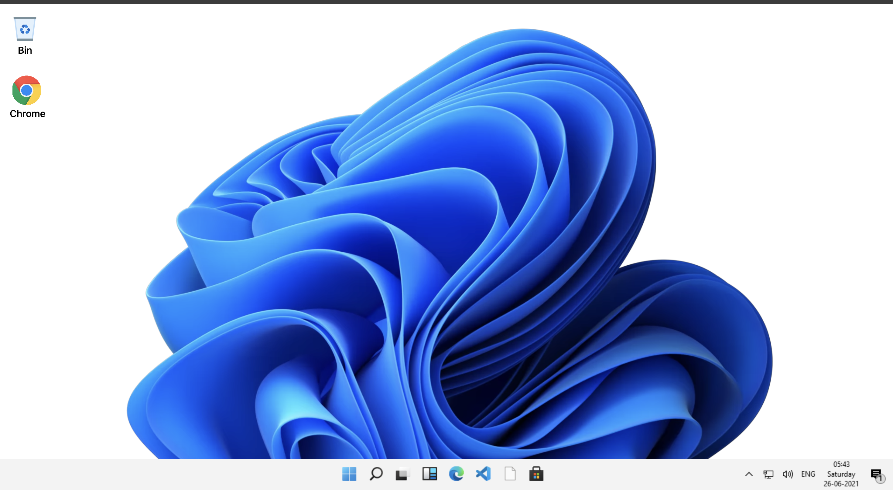

## Windows 11 Desktop Clone

A clean, minimal, and functional **Windows 11 Desktop UI Clone** built using **HTML, CSS, and JavaScript**.  
Includes a taskbar, start menu animation, desktop icons, and a modern Windows-style right-click context menu with smart positioning (never goes off-screen).

---

## 🚀 Live Demo  
👉 **Live Site:** https://dev-hamza03.github.io/windows-11-desktop-clone/

## 📦 GitHub Repository  
👉 **Repo:** https://github.com/dev-hamza03/windows-11-desktop-clone

---

## 📸 Screenshot



---

## ✨ Features

- 🖥️ **Windows 11–style desktop UI**
- 🔻 **Start menu slide animation** (opens + closes smoothly)
- 🖱️ **Custom right-click context menu** with:
  - Smooth hover effects  
  - Auto-positioning (never touches screen edges)
- 📁 **Desktop icons** (Recycle Bin, Chrome)
- 🎥 **Full Windows 11 wallpaper video background**
- 🎨 **Smooth UI, blur effects, animations & modern styling**
- ⚡ **Pure HTML + CSS + JavaScript** — no libraries used

---

## 📁 Project Structure

```
│── index.html
│── style.css
│── script.js
│── assets/
│   ├── video.webm
│   ├── icons.PNG
│   ├── taskbarright.PNG
│   ├── recyclebinicon.png
│   ├── chromeicon.png
│   └── startmenu.PNG
```

---

## 🧠 How It Works

### ✅ Start Menu Animation
Toggled by clicking the taskbar icon.

```js
taskBar.addEventListener("click", () => {
    if (menu.style.bottom === "-102%") {
        menu.style.bottom = "8%";
    } else {
        menu.style.bottom = "-102%";
    }
});
```

### ✅ Smart Right-Click Menu
Prevents the menu from going outside the viewport.

```js
document.addEventListener("contextmenu", (e) => {
    e.preventDefault();

    const menuWidth = rightClickMenu.offsetWidth;
    const menuHeight = rightClickMenu.offsetHeight;
    const screenWidth = window.innerWidth;
    const screenHeight = window.innerHeight;

    let posX = e.pageX;
    let posY = e.pageY;

    if (posX + menuWidth > screenWidth) posX = screenWidth - menuWidth - 25;
    if (posY + menuHeight > screenHeight) posY = screenHeight - menuHeight - 25;

    rightClickMenu.style.left = posX + "px";
    rightClickMenu.style.top = posY + "px";
    rightClickMenu.style.display = "block";
});
```

---

## 🛠️ Technologies Used

- **HTML5**
- **CSS3 (Flexbox, blur effects, animations)**
- **Vanilla JavaScript**
- **Windows UI design principles**

---

## 💡 Future Improvements

- Add draggable windows  
- Add a functional task view  
- Add settings & real apps  
- Add double-click desktop interactions  

---

## 👨‍💻 Author

Made by **Hamza**  
```
GitHub: https://github.com/dev-hamza03
```

---

## 📜 License

This project is open-source and free to use.

